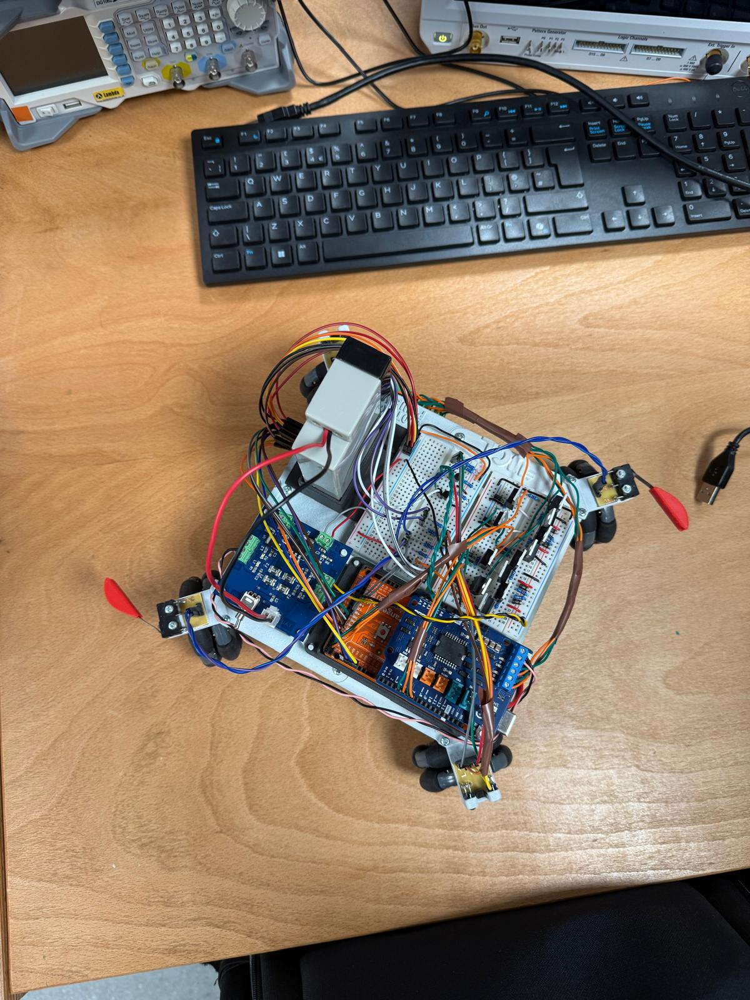

# Autonomous Maze-Navigating Robot

Navigation and control software for an Arduino Mega omni-directional robot that **completed the maze fully autonomously** and received **full marks in every test and assessment**.

*UCL team project, team of 5, June 2026. My role: Planning and Control Logic (navigation algorithm, state machine, integration of all subsystems).*

<p align="center">
  
</p>

## Hardware

| Part | Details |
|---|---|
| Controller | Arduino Mega |
| Forward / backward drive | 2 motors on an Arduino Motor Shield Rev3 |
| Left / right strafe | 2 motors on a student-built H-bridge |
| Feedback | 4 quadrature encoders |
| Sensing | Front and rear photodiode sensors, side limit switches |

## How it works

The robot drives towards each wall, holds a set distance from it, then strafes sideways to find the gap and passes through, repeating until it exits the maze.

### Non-blocking state machine

```
        ┌──────────┐   wall reached   ┌──────┐
 ──────▶│ APPROACH │ ───────────────▶ │ HOLD │ ◀──────────────────┐
        └──────────┘                  └──┬───┘   drifted too close │
             ▲                           │ distance settled        │
             │ next wall                 ▼                         │
        ┌──────────┐   gap found   ┌───────────────────────────┐   │
        │ PASS_GAP │ ◀──────────── │ SEARCH_RIGHT / SEARCH_LEFT│ ──┘
        └──────────┘               └────────────┬──────────────┘
                                                │ both sides blocked
                                                ▼
                                           ┌─────────┐
                                           │ TRAPPED │
                                           └─────────┘
```

- **No `delay()` calls.** Every state handler returns immediately, so sensors and encoders are read on every loop.
- `enterState()` handles every transition in one place and logs it over Serial.
- **Drift safety:** if the robot drifts too close to the wall while strafing, it drops back to HOLD to re-settle, then resumes searching the *same* side without losing its progress.

### Gap detection

A gap is only accepted when **both** conditions hold:
1. The front sensor reads "clear" consistently for longer than a confirmation time (`stableFrontClear()`), which filters out false edges from irregular walls.
2. The encoders show the robot has strafed further than `GAP_THRESHOLD`.

### Pattern-aware search

The maze gaps alternate sides (right, left, right, …), so the robot counts gaps already passed (`gapsPassed`) and searches the **predicted** side first (`predictedSearchSide()`). If a side limit switch is hit before a gap is found, it falls back to the other side; if both sides are blocked, it stops in `TRAPPED`.

## Integration

Teammates built the sensor, H-bridge and motor shield/encoder subsystems. I merged them into one codebase:
- Prefixed H-bridge functions with `hb_` and motor shield functions with `sh_` to remove naming collisions.
- Wrote standalone test programs for the motor-control and encoder test stations.

## Source code

This was assessed university coursework, so the source code is kept in a private repository. It is available on request.
